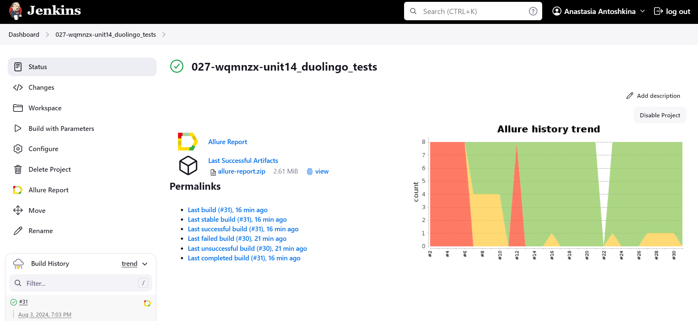
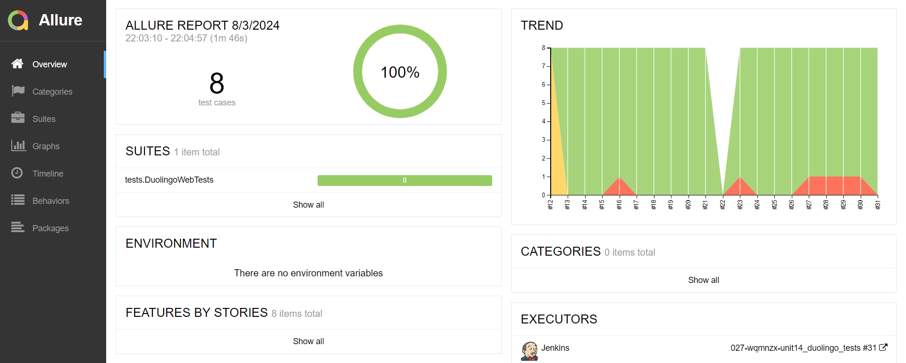
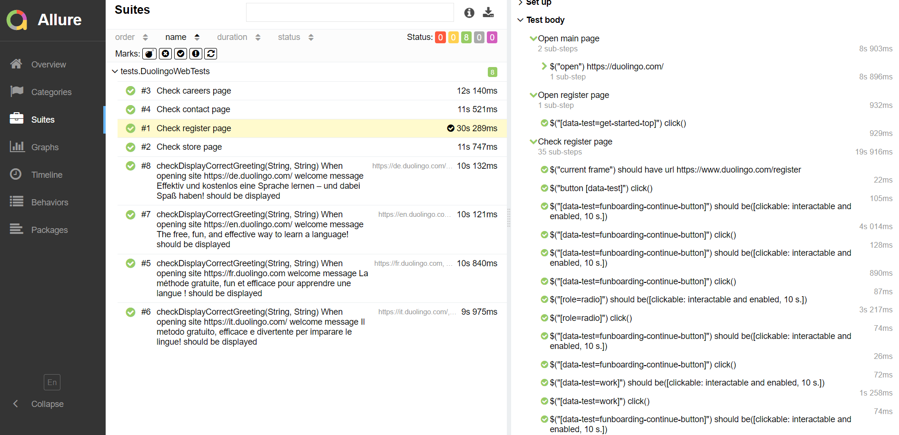
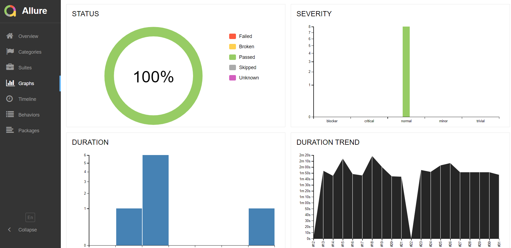
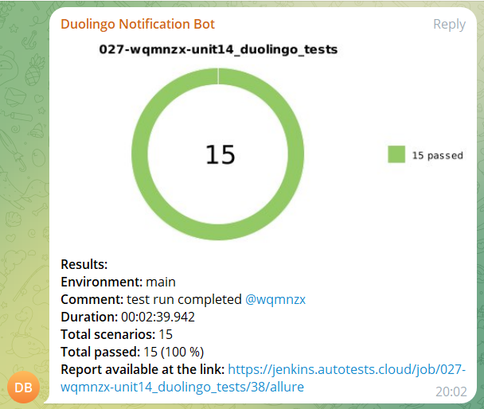
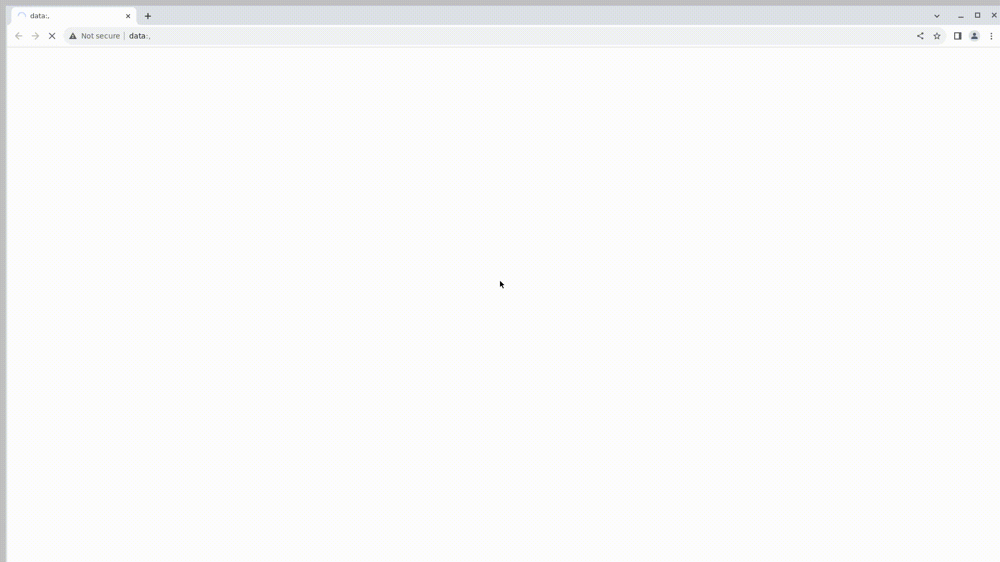

# Automation project for [Duolingo.com](https://www.duolingo.com/) [](https://www.duolingo.com/)
>With more than 500 million learners, Duolingo has the world's largest collection of language-learning data at its fingertips. This allows us to build unique systems, uncover new insights about the nature of language and learning, and apply existing theories at scales never before seen.

## :scroll: Table of contents
- [Technology stack](#computer-technology-stack)
- [Automated tests](#ballot_box_with_check-automated-tests)
- [Jenkins build](#-jenkins-build)
- [Allure report](#-allure-report)
- [Telegram notifications](#-telegram-notifications)
- [Test execution in Selenoid](#-test-execution-in-selenoid)

## :computer: Technology stack
<p align="center">
<a href="https://www.jetbrains.com/idea/"></a> 
<a href="https://www.java.com/"></a>
<a href="https://selenide.org/"></a> 
<a href="https://aerokube.com/selenoid/"></a>
<a href="https://github.com/allure-framework/allure2"></a>
<a href="https://gradle.org/"></a> 
<a href="https://junit.org/junit5/"></a> 
<a href="https://github.com/"></a> 
<a href="https://www.jenkins.io/"></a>
</p>

Automated tests:
- Implemented in ```Java``` language
- ```Gradle``` is used as a collector
- The frameworks used are ```JUnit 5``` and ```Selenide```
- When running tests, the browser starts in ```Selenoid```
- For remote launch, build in ```Jenkins``` is used
- ```Allure Report``` is generated for the build

Allure report:
* Test steps
* Screenshot of the page at the last step
* Source code
* Browser console logs
* Test execution video

## :ballot_box_with_check: Automated tests

- Check welcome message
- Check register page
- Check careers page
- Check contact page
- Check store page

##  [Jenkins build](https://jenkins.autotests.cloud/job/027-wqmnzx-unit14_duolingo_tests/)
[](https://jenkins.autotests.cloud/job/027-wqmnzx-unit14_duolingo_tests/)

### *Jenkins build options:*
```TASK``` - task name (possible options - ```duolingo```, ```smoke```, ```regress```)
```BROWSER``` - browser for running tests (default - ```chrome```)  
```BROWSER_VERSION``` - browser version (default - ```122```)  
```BROWSE_SIZE``` - browser window size (default - ```1920x1080```)


### *Launch commands*


***Locally:***
```bash
gradle clean duolingo
```
When running this command in the IDE terminal, the tests run remotely in <code>Selenoid</code> by default.

```bash
gradle clean duolingo -DisRemote=false
```
When running this command in the IDE terminal, the tests run on the local machine.

```bash
gradle clean smoke
```
When running this command in the IDE terminal, only tests with teg <code>smoke</code> run.

```bash
gradle clean regress
```
When running this command in the IDE terminal, only tests with teg <code>regress</code> run.

***Via Jenkins:***
```java
clean ${TASK}
-Dbrowser=${BROWSER}
-DbrowserVersion=${BROWSER_VERSION}
-DwindowSize=${WINDOW_SIZE}
```

To start the build:
1. Go to the build
2. Click on ```Собрать с параметрами```/```Build with parameters```
3. Click on ```Собрать```/```Build```

##  [Allure report](https://jenkins.autotests.cloud/job/027-wqmnzx-unit14_duolingo_tests/allure/)
After the build is completed the icon [](https://jenkins.autotests.cloud/job/027-wqmnzx-unit14_duolingo_tests/allure/), is displayed in ```История сборок```/```Build History```.
When clicking on the icon, a page with a generated html report and test documentation opens.
### *Main report page*
[](https://jenkins.autotests.cloud/job/027-wqmnzx-unit14_duolingo_tests/allure/)

### *Test cases*
[](https://jenkins.autotests.cloud/job/027-wqmnzx-unit14_duolingo_tests/allure/#suites)

### *Graphs*
[](https://jenkins.autotests.cloud/job/027-wqmnzx-unit14_duolingo_tests/allure/#graph)

##  Telegram notifications

After the build is completed, a special bot created in ```Telegram``` automatically processes and sends a message with a test run report.

[]()

##  Test execution in Selenoid

In Allure reports, each test is accompanied by not only a screenshot, but also a video of the test execution.
For example:

[]()
